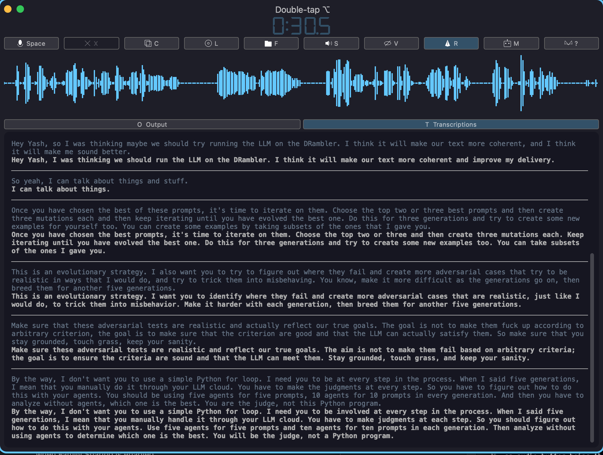
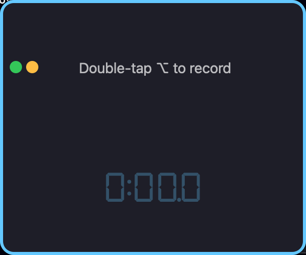
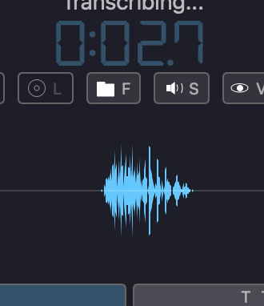
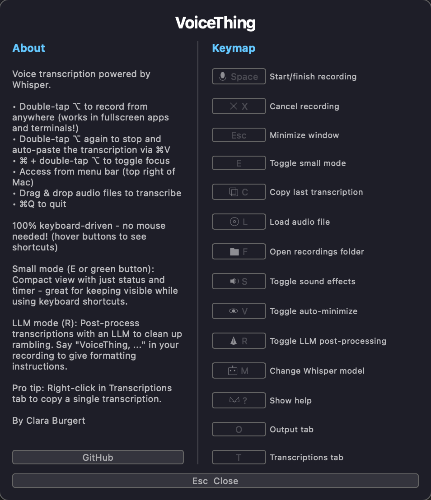

# VoiceThing

A fast, keyboard-driven voice transcription app for macOS, powered by Whisper with Metal GPU acceleration.



## Features

- **Double-tap ⌥ (Option)** to start/stop recording from anywhere - works in fullscreen apps and terminals
- **Instant transcription** using Whisper with Apple Silicon Metal GPU acceleration
- **Auto-paste** - transcription is automatically copied and pasted via ⌘V
- **100% keyboard-driven** - no mouse needed
- **Wake word detection** - two engines available:
  - **OpenWakeWord** - fast ML-based detection with pre-trained models
  - **macOS Native** - custom phrases, cancel phrases, and tmux pane routing
- **Cancel phrases** (macOS Native) - say "cancel" or "never mind" to abort recording
- **Tmux mode** - paste transcriptions directly into your active tmux pane
- **Tmux Pane Manager** - visual pane selection with live terminal preview
  - Voice routing with magic phrases (say "chicken" to send to a specific pane)
  - Blue mode fullscreen with floating main window
  - Keyboard input forwarded to tmux panes
  - Cmd+V paste and tmux clipboard paste
- **LLM post-processing** (Anti-Ramble mode) - clean up filler words and self-corrections
- **De-ramble after the fact** - click the pen button on any transcription to apply LLM processing
- **Text-to-speech** - speak back transcriptions via multiple backends (macOS say, Supertonic, Kitten)
- **Multiple themes** - Cyberpunk Metal, macOS 2005, Arrow, Foliage, Winamp, and more
- **Animated pets** - optional companion animations (Emmy the spider)
- **Notification chimes** - customizable instrument sounds with piano visualization
- **Menu bar access** - always available from macOS menu bar
- **Drag & drop** audio files to transcribe
- **Retranscribe** - re-transcribe latest recording with a different model

## Screenshots

| Idle State | Transcribing | Help Dialog |
|------------|--------------|-------------|
|  |  |  |

## Requirements

- **macOS** with Apple Silicon (M1/M2/M3/M4)
- **Python 3.10**
- **Accessibility permissions** for global keyboard shortcuts

## Installation

```bash
# Clone the repository
git clone https://github.com/RyannDaGreat/VoiceThing.git
cd VoiceThing

# Create a conda/mamba environment (recommended)
mamba create -n voicething python=3.10 -y
mamba activate voicething

# Install dependencies
pip install -r requirements.txt

# Run
python voice_thing.py
```

On first run, you'll need to grant Accessibility permissions to your terminal app (System Settings → Privacy & Security → Accessibility).

## Keyboard Shortcuts

| Key | Action |
|-----|--------|
| `Space` | Start/stop recording |
| `X` | Cancel recording |
| `Esc` | Minimize window |
| `E` | Toggle small mode |
| `G` | Toggle maximize |
| `B` | Toggle blue mode (tmux fullscreen) |
| `W` | Toggle simple mode |
| `C` | Copy last transcription |
| `Z` | Retranscribe latest with current model |
| `L` | Load audio file |
| `F` | Open recordings folder |
| `S` | Toggle sound effects |
| `H` | Toggle auto-minimize |
| `R` | Toggle LLM post-processing |
| `J` | Toggle wake word detection |
| `N` | Toggle auto-enter |
| `U` | Open tmux pane manager |
| `M` | Change Whisper model |
| `P` | Open preferences |
| `?` | Show help |
| `O` | Output tab |
| `T` | Transcriptions tab |

**Global shortcuts:**
- `⌥⌥` (double-tap Option) - Start/stop recording from anywhere
- `⌘ + ⌥⌥` - Toggle window focus
- Hold `⌥⌥` for 1.5s while recording - Cancel recording

## Whisper Models

| Key | Model | Description |
|-----|-------|-------------|
| `T` | tiny | Fastest, least accurate (~1GB VRAM) |
| `B` | base | Fast, basic accuracy (~1GB VRAM) |
| `S` | small | Balanced speed/accuracy (~2GB VRAM) |
| `M` | medium | Good accuracy, slower (~5GB VRAM) |
| `L` | large-v3 | Best accuracy, slowest (~10GB VRAM) |

## Wake Word Detection

Two wake word engines are available:

### OpenWakeWord (Fast)
- ML-based detection with pre-trained models
- Lower CPU usage and faster response
- Limited to available model phrases (Hey Jarvis, Alexa, Computer, etc.)

### macOS Native (Flexible)
- Custom phrases - use any words you want
- Cancel phrases - say "cancel" or "never mind" to abort recording
- Tmux pane routing - assign phrases to specific panes
- Slower response time, shows microphone indicator

When you say the wake word, recording starts automatically. Say the wake word again (or press Space) to stop recording and transcribe.

## LLM Post-Processing (Anti-Ramble Mode)

Press `R` to enable LLM post-processing. This uses a local Ollama model to:
- Remove filler words (um, uh, "you know")
- Collapse stutters ("set the- set the-" → "set the")
- Apply self-corrections ("actually change X to Y")
- Clean up rambling while preserving your exact words

Say "VoiceThing, ..." in your recording to give formatting instructions directly to the LLM.

## Tmux Mode

Press `U` to open the Tmux Pane Manager:

- **Visual pane selection** - see all your tmux panes in a table
- **Live terminal preview** - see pane contents in real-time with ANSI colors
- **Magic phrases** - assign voice phrases to route transcriptions to specific panes
- **Keyboard passthrough** - type directly into the selected pane from the preview
- **Blue mode** - fullscreen tmux manager with main window floating on top
- **Dark/light mode** - toggle terminal preview theme
- **Zoom controls** - adjust preview font size

This is useful for:
- **Terminal workflows** - dictate commands or text directly into terminal sessions
- **Remote sessions** - works even when the terminal isn't the frontmost app
- **Multi-pane routing** - say "chicken, do something" to send to a pane named "chicken"
- **Auto-enter** - combine with `N` (auto-enter) to automatically execute commands

Requires tmux to be installed and running.

## Themes

Multiple visual themes available in Preferences:
- Cyberpunk Metal (default)
- macOS 2005
- Arrow
- Foliage
- Winamp
- And more...

## Notification Chimes

Customizable audio feedback with:
- Volume and pitch controls
- Multiple instrument presets (bells, organ, flute, strings, etc.)
- Piano keyboard visualization
- Per-action chime themes

## Author

By Clara Burgert
